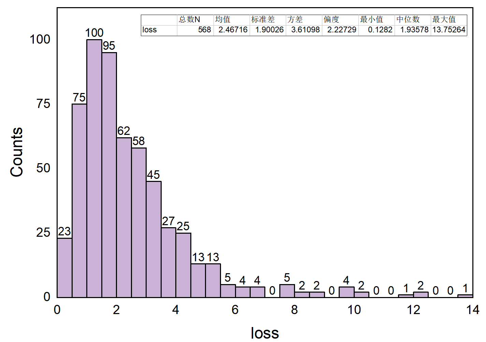

### RRAM parameters:
input bit = 8; weight bit = 4; output bit = 8.  
noise scale = 0.075

**results are as follows:** 

|      |   N | 均值 | 标准差 | 方差 | 偏度| 最小值| 中位数| 最大值 |
|:-----|----|----|-----|----|----|----| ----|----|
| loss | 568 |2.46716| 1.90026|3.61098 |2.22729| 0.1282 |1.93578 |13.75264|

